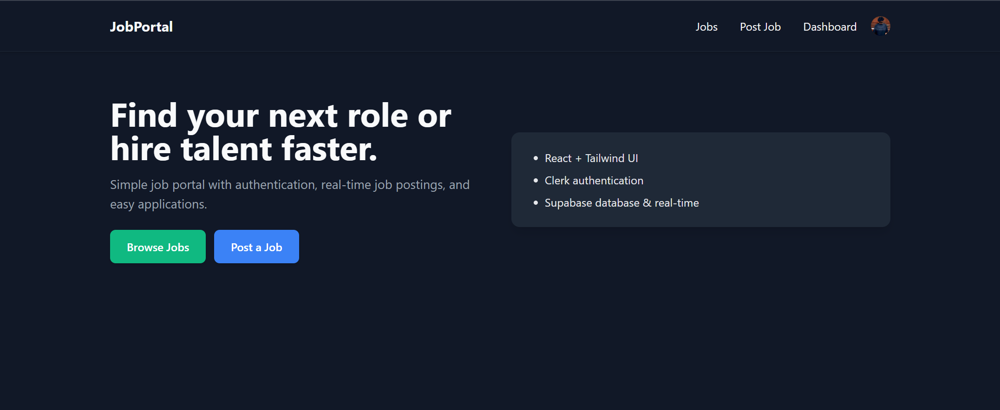

# Job Portal MVP (React + Tailwind + Clerk + Supabase)

A minimal, clean job portal you can run locally and deploy. This project features a modern, theme-aware design that automatically adapts to the user's system settings.

### Features:
- **Responsive UI:** A clean, high-contrast design that works flawlessly in both light and dark modes.
- **Browse Jobs:** Search and filter jobs by title, company, and location.
- **Post Jobs:** Employers can post new job listings.
- **Apply to Jobs:** Candidates can apply to open positions.
- **Authentication:** Secure user management via Clerk.
- **Database & Real-time:** Backend services and real-time updates powered by Supabase.



## 1) Setup

### Prerequisites
- Node.js (LTS)
- A free [Clerk account](https://clerk.com)
- A free [Supabase project](https://supabase.io)

### Get Started
```bash
npm install